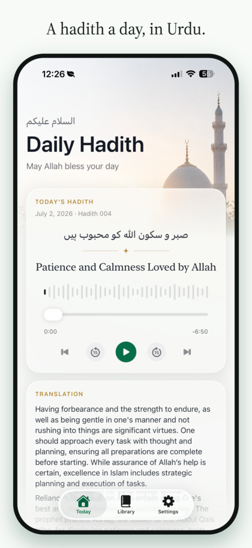
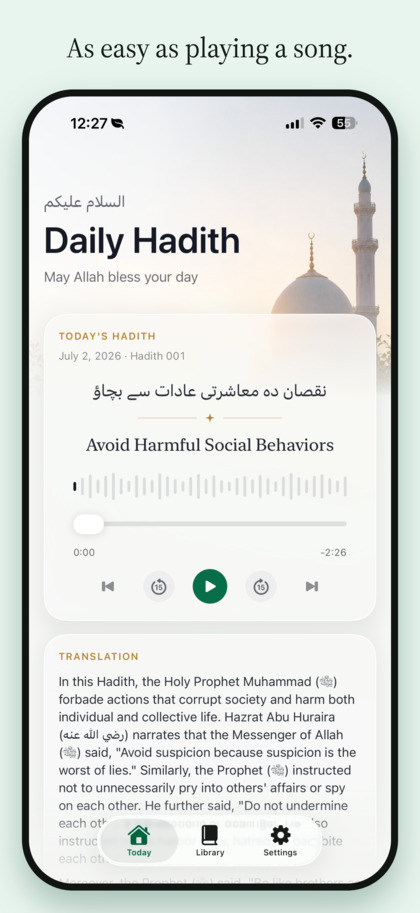
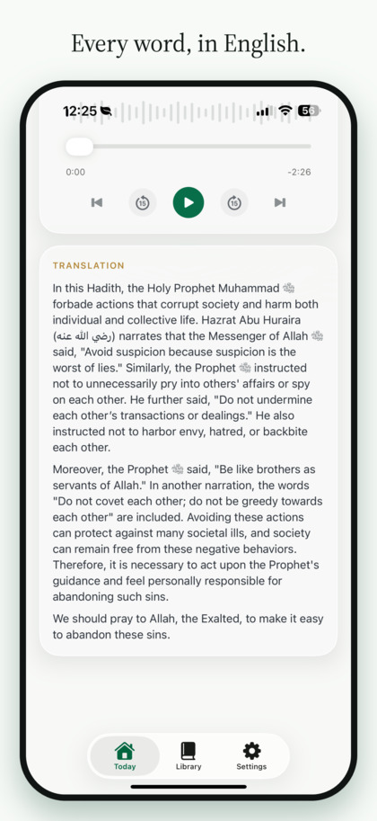
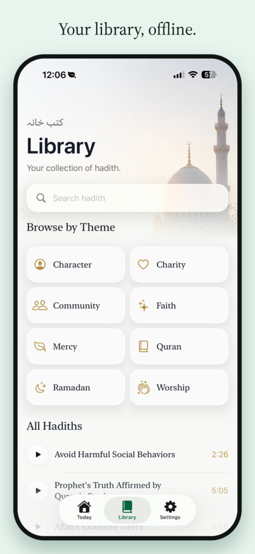

# Daily Hadith

Daily Hadith is a native iPhone app for listening to a curated offline library of Urdu hadith audio, one entry at a time. It keeps the original audio as the source of truth, adds reviewed English reading support, and presents everything in a quiet SwiftUI interface inspired by native iOS media apps.

<p align="center">
  
  
  
  
  
</p>

## What It Does

- Plays 118 bundled Urdu audio hadiths offline.
- Advances through a simple daily sequence and loops after the final item.
- Saves playback position and listened state locally on device.
- Shows reviewed English titles, summaries, and translations.
- Offers a searchable library with theme browsing.
- Supports first-run onboarding and optional daily reminder notifications.
- Includes light and dark appearances with progressive Liquid Glass styling.

## Design Principles

Daily Hadith is intentionally small. It avoids accounts, feeds, streak pressure, ads, analytics, and remote content updates. The app is meant to feel like opening a calm native audio companion rather than managing another productivity system.

The main surfaces are:

- **Today**: the current daily hadith, player controls, and English translation.
- **Library**: the full ordered audio collection, search, and theme browsing.
- **Settings**: reminders, app information, reset controls, charity link, and dedication.

## Tech Stack

- SwiftUI
- AVFoundation
- UserNotifications
- Local JSON content manifest
- Bundled `.m4a` audio resources
- Node.js content pipeline scripts for audio preparation and transcript review

## Project Structure

```text
DailyHadithApp/
  App/                  App entry, root shell, tab state
  Content/              Hadith models, repository, themes
  DesignSystem/         App colors, typography helpers, glass surfaces
  Features/
    Home/               Daily player and translation surface
    Library/            Search, themes, list, result views
    Onboarding/         First-run onboarding and reminder setup
    Settings/           Reminder, charity, reset, about, dedication
  Playback/             AVAudioPlayer-backed playback store
  Progress/             Local listened-state persistence
  Reminders/            Local notification scheduling
  Resources/            Audio bundle, reviewed manifest, privacy manifest
scripts/                Reusable content pipeline tooling
docs/                   Architecture notes, content pipeline, support/privacy pages
```

## Running Locally

Open the project in Xcode:

```sh
open DailyHadith.xcodeproj
```

Or build from the command line:

```sh
xcodebuild \
  -project DailyHadith.xcodeproj \
  -scheme DailyHadith \
  -destination 'platform=iOS Simulator,name=iPhone 17' \
  build
```

The app is iPhone-only and expects the bundled resources under `DailyHadithApp/Resources/`.

## Content Pipeline

The app content was built from exported Urdu audio files and reviewed enrichment metadata. The reusable scripts live in `scripts/`, with the full workflow documented in [docs/hadith-pipeline.md](docs/hadith-pipeline.md).

Common commands:

```sh
node scripts/hadith-pipeline.mjs prepare
node scripts/hadith-pipeline.mjs enrich
node scripts/hadith-pipeline.mjs review --apply
node scripts/hadith-pipeline.mjs sync-app
```

For OpenAI-backed enrichment, copy `.env.example` to `.env.local` and add your own API key. Do not commit local keys or generated scratch exports.

## Privacy

Daily Hadith does not use accounts, analytics, ads, tracking, or a backend. Listening progress, playback positions, onboarding state, and reminder preferences are stored locally on device.

- [Privacy Policy](docs/privacy.html)
- [Support](docs/support.html)

## Content Rights

The app includes third-party religious audio content and generated/reviewed text derived from that audio. Before redistributing the bundled audio or publishing derivative builds, confirm that you have the necessary rights for your use case. The Urdu audio remains the canonical source content.

## License

The app source code is available under the [MIT License](LICENSE). Bundled audio, generated religious text content, screenshots, app icon, and other media assets are not relicensed by the code license.

## Repository Notes

- `Content/Audio/`, `exports/`, and local screenshots are ignored scratch space.
- App Store screenshots are generated outside the source tree; README images are resized copies under `docs/assets/readme/`.
- Architecture decisions live in `docs/adr/`.
